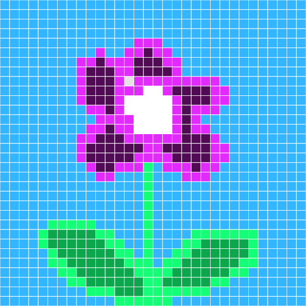

  

<h3 align="center">SharePix!</h3>

---

 Online platform dedicated to pixel art, providing a user-friendly environment for creating, showcasing, and collaboratively engaging with pixel art enthusiasts of all skill levels.
      

## 📝 Table of Contents

- [📝 Table of Contents](#-table-of-contents)
- [🧐 About ](#-about-)
- [🎈 Features ](#-features-)
- [⛏️ Built Using ](#️-built-using-)
- [✍️ Authors ](#️-authors-)
- [🎉 Acknowledgements ](#-acknowledgements-)
  - [JS Libraries](#js-libraries)
  - [Image Sources](#image-sources)

## 🧐 About 

SharePix is a dynamic Django-based web application designed for pixel art enthusiasts. It offers a user-friendly platform where users can craft and showcase their pixel art creations. This interactive online community encourages sharing, collaboration, and engagement among pixel artists, fostering a vibrant and creative environment for both beginners and experienced artists.

## 🎈 Features 

- Login: because drawings are (supposed to be) private to each user, we implemented OAuth as well as user account management system.
- Social Feed: the user can post and share their finished artwork on the social feed. Other users will be able to comment and send likes on it.
- Users can follow and unfollow other users, and keep track of their favorite artists.
- Pixel Art Creation: a canvas to create pixel art which supports
  - various types of paint brushes
  - eraser & erase all
  - color bucket
  - color palette
  - forward & backward actions
- Export: able to export artwork as png or send it to somewhere else separately.
- Save Draft Feature: keep track of progress of artwork and save it with the account associated/currently logged in as.

## ⛏️ Built Using 

- [SQLite](https://www.sqlite.org/index.html/) - Database for initial deployment and testing
- [MySQL](https://www.mysql.com/) - Database
- [Django](https://www.djangoproject.com/) - Server Framework
- [Bootstrap](https://getbootstrap.com/) - Website Styling
- [P5JS](https://p5js.org/) - Canvas Feature

## ✍️ Authors 

- [@zhixuanevelynwu](https://github.com/zhixuanevelynwu)
- [@wkang1](https://github.com/wkang1)

## 🎉 Acknowledgements 

### JS Libraries
- [jscolor](https://jscolor.com/)
### Image Sources
- [pixel-cursor.png](https://pnghut.com/png/VeKcXBLVti/computer-mouse-pointer-pixel-clip-art-display-device-cursor-transparent-png)

